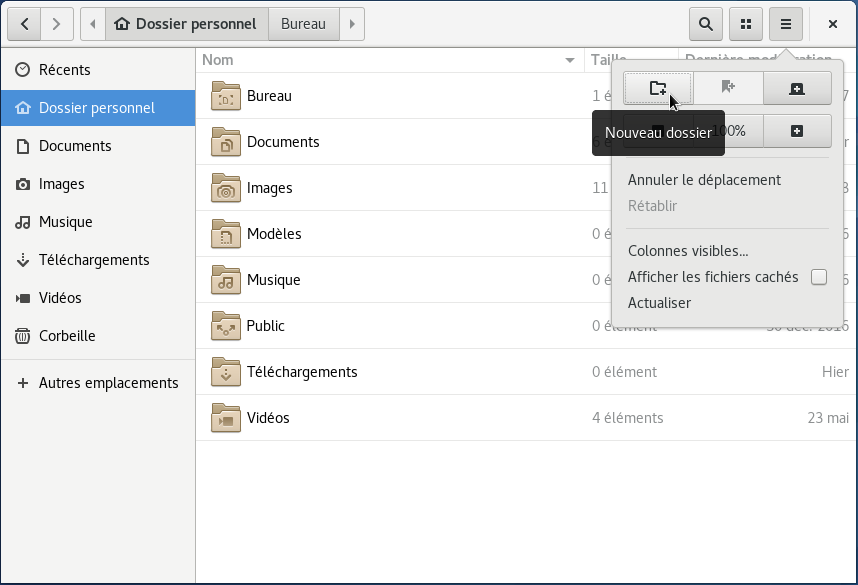
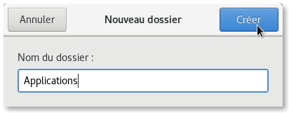
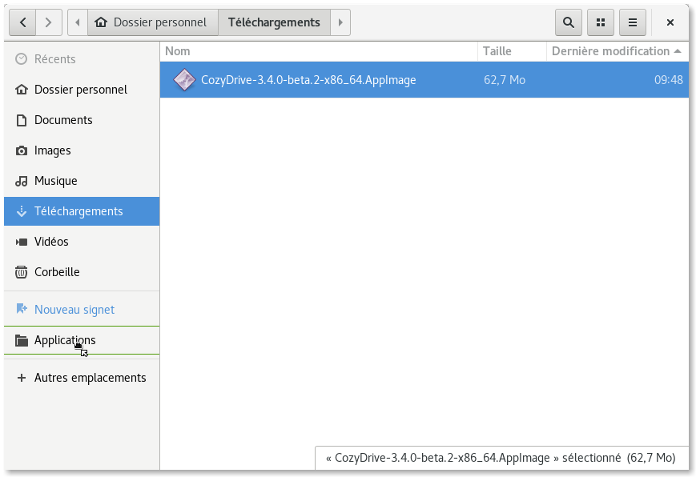
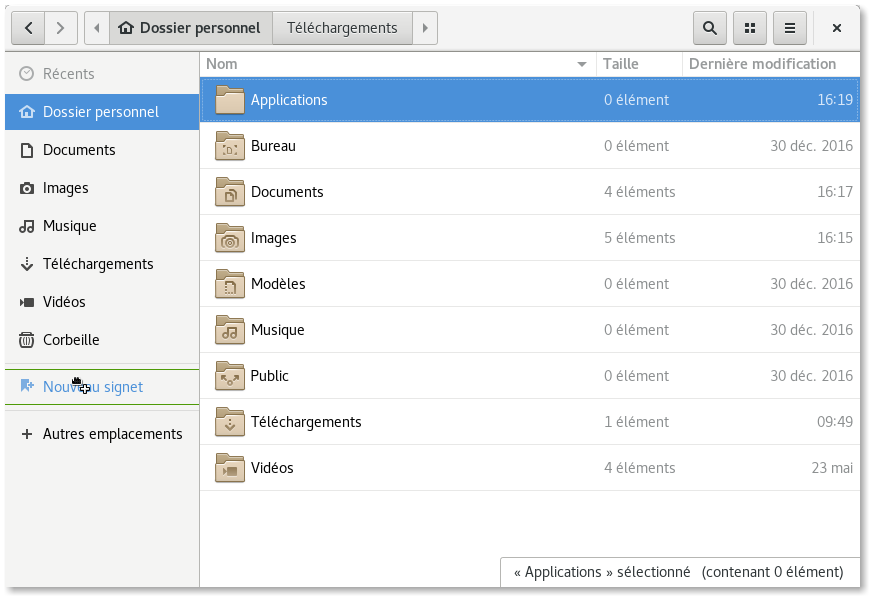

# Install the desktop client on your GNU/Linux system

To ease the use of Cozy Drive on any distribution, we distribute the application using the [AppImage](https://appimage.org/) format. This way, you have nothing to install, just download the application and run it.

We provide packages for both [32 bits](https://nuts.cozycloud.cc/download/channel/stable/32) and [64 bits](https://nuts.cozycloud.cc/download/channel/stable/64) systems. All you have to do is download the file, move it to some dedicated folder, make it executable and run it.

## Detailed instructions on Gnome

Click on one of this links to download Cozy Drive for your OS:

 - [Cozy Drive for GNU/Linux 32 bits](https://nuts.cozycloud.cc/download/channel/stable/32);
 - [Cozy Drive for GNU/Linux 64 bits](https://nuts.cozycloud.cc/download/channel/stable/64);

Once the binary file downloaded, go to the folder where your browser has stored it. For example, if you use Firefox, click on the folder icon in the download list.

To be able to run the application, you have to edit its properties to make it executable. Just right click on the application and select `Properties` inside the context menu:

Then go to the `Permissions` tab and check box to make the application executable:

There’s no need to install the application, you can just run it from the folder you have downloaded it, but we recommend to move it to a dedicated folder to be able to find it easily. You can create a `Cozy` folder inside your home directory and move the application there:

Tip: you can add this folder to your bookmarks to find it easily:

That’s all. You can now double-click on the application to launch it and connect it to your server. Have fun!
